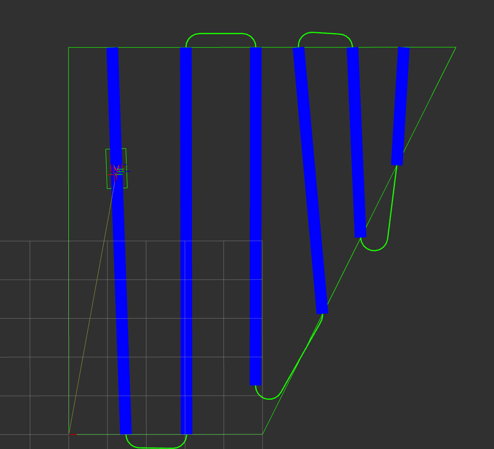

# Open Navigation's Nav2 Complete Coverage

This package contains the Complete Coverage Task Server & auxiliary tools utilizing the [Fields2Cover](https://github.com/Fields2Cover/Fields2Cover) complete coverage planning system which includes a great deal of options in headland, swath, route, and final path planning. You can find more information about Fields2Cover (F2C) in its [ReadTheDocs Documentation](https://fields2cover.github.io/index.html). It can accept both GPS and Cartesian coordinates and publishes the field, headland, swaths, and route as separate topics in cartesian coordinates for debugging and visualization. It can also compute coverage paths based on open-field polygons **or** based on annotated rows as might exist in a tree farm or other applications with both irregular and regular pre-established rows.

This capability was created by [Open Navigation LLC](https://www.opennav.org/) in partnership with [Bonsai Robotics](https://www.bonsairobotics.ai/). Bonsai Robotics builds autonomous software for machines in adverse and GPS degraded conditions utilizing vision. Bonsai Robotics funded the development of this work for their own product and has graciously allowed Open Navigation to open-source it for the community to leverage in their own systems. Please thank Bonsai Robotics for their commendable donation to the ROS community! Bonsai is hiring [here](https://www.bonsairobotics.ai/jobs).


This server exposes all of the features of Fields2Cover as a Lifecycle-Component Nav2 Task Server like all others within the Nav2 Framework, so it should feel very familiar to those using Nav2 already. The server is split into modular stages with factories and enum types for all known options which can be easily expanded up over time scalably. It even could be expanded to include custom coverage capabilities separate of F2C if desired. This capability is split into 5 packages:

- `opennav_coverage`: Contains the main Nav2 Task Server. Given a **field polygon**, computes swaths, routes, and paths. Best of 'open field' applications with regular rows desired.

- `opennav_row_coverage`: Contains another main Nav2 Task Server. Given a set of **precomputed** or **annotated** rows, computes swaths, routes, and paths. Best for applications with pre-established or irregular rows.

- `opennav_coverage_msgs`: Contains the action definition for the Coverage Navigator, Coverage Planner. Also contains several useful message types for F2C.

- `opennav_coverage_bt`: Contains the Behavior Tree Nodes and an example XMLs file using the Task Server to complete a simple coverage and row coverage navigation tasks.

- `opennav_coverage_navigator`: Contains the BT Navigator plugin exposing `NavigateCompleteCoverage` action server analog to `NavigateToPose` and `NavigateThroughPoses`.

- `opennav_coverage_demo`: Contains an example launch and python node to trigger the coverage planner for a demonstration of the Navigator Plugin, Server, BT nodes, XML, and such. 

Fields2Cover is a living library with new features planned to be added (for example those discussed in a [Nav2 integration ticket](https://github.com/Fields2Cover/Fields2Cover/issues/73)). As such, as new F2C capabilities are created, they will be welcome for integration here. If you see anything missing, please let us know or submit a PR to expose it!

[](https://www.youtube.com/watch?v=XC_qf5AyNpU)

Have pre-annotated rows due to physical constraints and want to still compute the patterned route & feasible paths between them? Extra wacky to show that they don't need to be parallel nor regularly spaced!

[](https://www.youtube.com/watch?v=NMznTft56jE)

PS: Click on either image to see the demo videos! :-)

## Interfaces

The two main interfaces are `NavigateCompleteCoverage` and `ComputeCoveragePath`. The first is the action definition to request the BT Navigator's `CoverageNavigator` plugin to navigate usign a Complete Coverage task input. The latter is an analog to the `PlannerServer`'s action definition for computing Complete Coverage paths using the `opennav_coverage` action server. See `opennav_coverage_msgs` for complete details.

### ComputeCoveragePath

This contains `generate_headland`, `generate_route`, and `generate_path` about whether the coverage task should remove a set headland, generate route to order the coverage swaths, or compute a path connecting the ordered route swaths; respectively. You can learn more about these stages in F2C's documentation - particularly from the graphic on its [index page](https://fields2cover.github.io/index.html).

Each of the stages (including `generate_swaths`, which is always on) has its own `_mode` message in the action containing its potential parameters to specify a mode. If not modified, it uses the parameters set in the server at launch time or after dynamic reconfiguration. See the parameter information below or the message files for complete details.

Finally, it contains the polygon information. This can be represented either as GML files, with [an example in `opennav_coverage/test`](./opennav_coverage/test/test_field.xml), or as a polygon in the message itself. If using GML files, set `goal.use_gml_file = true`.

When setting the polygon (`goal.polygons`), this is a vector of polygons. If only considering a bounding field, only populate the first field shape. If there are internal voids, use subsequent polygons to indicate them. The coordinate type has `axis1` and `axis2` instead of X and Y as the server can process both GPS and cartesian coordinates. If specifying the polygon outside of GML files, you must specify the frame of reference of the polygon using the `goal.frame_id` field. This is not used for GML files as those should contain the frame within it.

The result returns a `result.nav_path` -- which is a `nav_msgs/Path` containing the coverage path requested **only if** all `generate_path` is `true`. This can be followed by a local trajectory planner or controller directly. This is what is used in the `opennav_coverage_bt` examples for basic coverage navigation. It also returns `result.coverage_path` which contains an ordered set of swaths and paths to connect them (if applicable settings enabled) which can be used for more task-specific navigation. For example, navigating with a tool down or enabled on swaths and raised in turns to connect to other swaths. A utility is provided in `opennav_coverage/utils.hpp` for iterating through this custom `coverage_path` for convenience, `PathComponentsIterator`.

It also returns an error code, if any error occurred and the total planning time for metrics analysis.

Note that `SwathMode` settings are to be paired with the `opennav_coverage` server with polygons, while the `RowSwathMode` settings are to be paired with the `opennav_row_coverage` server based on annotated rows. 

### NavigateCompleteCoverage

The Coverage Navigator calls the `ComputeCoveragePath` action within its BT XML. This navigator plugin exists to expose to the application layer the fields required to do Coverage-type navigation tasks rather than go-to-pose type tasks. Thus, this Action does not contain a "goal" or "start" pose, but the field filepath or polygon of interest for coverage navigation. See the section above for discussion on those types. It also contains a `goal.behavior_tree` field to specify which behavior tree to navigate using -- if not the default.

It returns the error code from the BT's error code IDs if any error occurs. Otherwise, it returns live regular feedback on the robot's current position, navigation time elapsed, number of recoveries enacted, distance remaining in the path (if `nav_path` valid), and a rough ETA.

Navigator Plugins require **ROS 2 Iron or newer**. Otherwise, you may still use the Coverage Server in **Foxy or newer**, just don't compile the `opennav_coverage_navigator` package.

Note: `NavigateCompleteCoverage` action message and `CoverageNavigator` are subject to API changes to continue to be most useful to users! The current API is relatively basic and will be adapted as more users adopt its use and need additional fields exposed to the application layer. If you need any adjustments, feel free to ask!

## Configuration

The complete set of options are exposed as both dynamic parameters and through the Action definition to be used as you prefer. Parameters are useful for consistent requests with the same configurations and actions are useful when changing parameters on a per-request basis. When any of the fields in `XYZMode.msg` messages are filled in, all must be filled in to be a complete request of a stage's mode parameters. `HeadlandMode`, `SwathMode`, `RouteMode`, and `PathMode` contain the complete parameter options for each of those stages in F2C coverage planning. The parameters given (or defaults) will be used for each stage, but any single stage can be overwritten via the Action message.

### Coverage Server


| Parameter                    | Description                                    | Type   |
|------------------------------|------------------------------------------------|--------|
| action_server_result_timeout | Action server result holding timeout (s)       | double |
| coordinates_in_cartesian_frame | Whether incoming requests are in cartesian or GPS coordinates | bool |
| robot_width  | Robots width (m)  | double |
| operation_width  | Width of implement or task for coverage  | double |
| min_turning_radius  | Minimum turning radius for path planning  | double |
| linear_curv_change  | Max linear curvature change | double |
| default_allow_overlap  | Whether to allow some coverage overlap in final pass to fill space by default. Only for `opennav_coverage`  | bool |
| default_custom_order  | Default custom order of swaths -> route in CUSTOM mode | `vector<int>` |
| default_headland_type  | Default headland mode. Option: CONSTANT. Only for `opennav_coverage`  | String |
| default_headland_width  | Default headland width to remove from field. Only for `opennav_coverage` | double |
| default_path_continuity_type  | Default path continuity mode. Option: DISCONTINUOUS, CONTINUOUS | String |
| default_path_type  | Default path mode. Option: DUBIN, REEDS_SHEPP | String |
| default_route_type  | Default route mode. Option: BOUSTROPHEDON, SNAKE, SPIRAL, CUSTOM  | String |
| default_spiral_n  | Default number for spiraling, when set as default | int |
| default_step_angle  | Default angular step to attempt swath generating in BRUTE_FORCE mode. Only for `opennav_coverage` | double |
| default_swath_angle  | Default swath angle to use when known for swathc generation in SET_ANGLE mode. Only for `opennav_coverage` | double |
| default_swath_angle_type  | Default swath angle computation type. Options: BRUTE_FORCE,SET_ANGLE. Only for `opennav_coverage`  | String |
| default_swath_type  | Default swath computation objective. Option: LENGTH, COVERAGE, NUMBER for `opennav_coverage`; Option: OFFSET, CENTER, ROWSARESWATHS for `opennav_row_coverage` | String |
| default_turn_point_distance  | Distance between points in path turns between swaths  | double |
| default_offset  | Offset to use for computing swaths from annotated rows. Only for `opennav_row_coverage` | double |
| order_ids  | For `opennav_row_coverage`, whether to reorder the parsed rows in the order of their `id`s | bool |

### CoverageNavigator

All type string.

| Parameter                    | Description                                    | Type   |
|------------------------------|------------------------------------------------|--------|
| path_blackboard_id           | Blackboard variable holding the path           | String |
| field_file_blackboard_id     | Blackboard variable holding the field filepath | String |
| field_polygon_blackboard_id  | Blackboard variable holding the polygon field  | String |
| polygon_frame_blackboard_id  | Blackboard variable holding the polygon frame  | String |

### Behavior Tree Nodes

#### ComputeCoveragePathAction Ports


| InputPort         | Description       | Type   |
|-------------------|-------------------|--------|
| generate_headland | Whether to remove headland from field for coverage | bool |
| generate_route    | Whether to generate ordered route of swaths     | bool |
| generate_path     | Whether to generate a path connecting ordered route swaths     | bool |
| file_field        | The filepath to the field GML     | string |
| file_field_id     | The ID of the GML file to use     | int |
| polygons          | The polygonsof the field     | `vector<geometry_msgs/Polygon>` |
| polygons_frame_id | The polygon's frame of reference   | string |


| OutputPort        | Description       | Type   |
|-------------------|-------------------|--------|
| error_code_id | The complete coverage error code"     | uint |
| planning_time | The time to compute coverage plan     | double |
| nav_path      | The coverage plan as a nav_msgs/Path to track directly     | `nav_msgs/Path` |
| coverage_path | The coverage plan as an ordered set of swaths and route connections     | `opennav_coverage_msgs/PathComponents` |


#### CoverageCancel Ports

N/A


#### A Quick Note On Skipping

Rows(r) and swaths(s) are numbered as such. r1, s1, r2, s2, .... rN-1, sN-1, rN. 
In order to skip particular rows the 'opennav_coverage_msgs/RowSwathMode' provides 'skip_ids'
to be populated. For example, if the skip ids were set to {1, 3} for five rows the output would be the following: s2, s4.

### Swath Generation

As noted about `opennav_row_coverage` provides three ways to compute swaths which are `CENTER`, `OFFSET` and `SWATHSAREROWS`.

The `CENTER` generator iterates through each row, calculating a center between consecutive rows.

The `OFFSET` generator iterates through each row, calculating a relative offset between consecutive rows. 

The `SWATHSAREROWS` generator iterates through each row and uses that row as the swath.


## Citation

If you use this work, please make sure to cite both Nav2 and Fields2Cover:

[Nav2 Paper](https://arxiv.org/abs/2003.00368)

```
@InProceedings{macenski2020marathon2,
  title = {The Marathon 2: A Navigation System},
  author = {Macenski, Steve and Martín, Francisco and White, Ruffin and Ginés Clavero, Jonatan},
  year = {2020},
  booktitle = {2020 IEEE/RSJ International Conference on Intelligent Robots and Systems (IROS)},
  url = {https://github.com/ros-planning/navigation2},
  pdf = {https://arxiv.org/abs/2003.00368}
}
```

[Fields2Cover Paper](https://arxiv.org/pdf/2210.07838.pdf)

```
@article{Mier_Fields2Cover_An_open-source_2023,
  author={Mier, Gonzalo and Valente, João and de Bruin, Sytze},
  journal={IEEE Robotics and Automation Letters},
  title={Fields2Cover: An Open-Source Coverage Path Planning Library for Unmanned Agricultural Vehicles},
  year={2023},
  volume={8},
  number={4},
  pages={2166-2172},
  doi={10.1109/LRA.2023.3248439}
}
```

## To fully integrate into Nav2

Within Fields2Cover [outlined here](https://github.com/Fields2Cover/Fields2Cover/issues/73):
- [ ] Optional starting / goal point on the field
- [ ] Voids in field
- [ ] Non-convex shaped fields
- [ ] Option to have turns be promised to be within polygon for confined spaces
- [ ] Overlapping operational segments when overlapping is desirable
- [ ] Around-border option

Within Nav2 and this work:

- [ ] Migrate the tester.py and demo's python scripts into the simple navigator's capabilities
- [ ] Add Nav2 System Test running the server
- [ ] Add a tutorial about using the coverage server / navigator
- [ ] Add server to Nav2 docs: configuration guide, migration guide, BT ports, groot index

